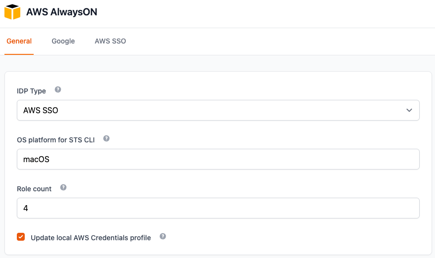
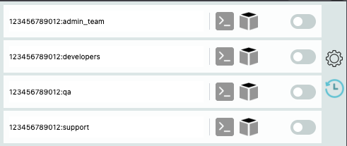

# AWS AlwaysON  

## Introduction
AWS AlwaysON is a browser extension that helps users stay connected to AWS, both in the web browser and CLI.

This extension can be used as an alternative to `aws-google-auth` and doesn't require inputing credentials as long as your Google account is logged in, nor does it suffer from constant Captcha.  
The extension was developed for Chrome but works mostly fine on all major browsers except Safari which was untested.  

## Supported providers
- Google Workspace as an IDP provier to AWS, 
- AWS SSO with any IDP Provider (Only Google was tested)

## Features
- Refresh AWS Web Console session automatically to keep user logged in. 
- Get temporary credentials for assumed role (STS) to use for CLI access.
- Automatically update local aws credentials file using provded clients.

## Installation

\* Should technically work with any chromium based browser.
 **Google Chrome:**  
Clone this repository.  
Go to the Chrome Extensions page.  
Enable Developer Mode on the right side of the page.  
Press "Load Unpacked".  
Pick the project folder.  


  
When you are done, exit the Options menu.  
Now you can add your user's IAM role or roles or click the time button to fetch them automatically. On AWS SSO, only automatic is avialble at this time since it is also acts as a scheduler.    
  

Click on the slider to start the token and client auto refresh procedure. On AWS SSO, this only acts as a client token refresh since all roles are globally loaded and refreshed using the time button.
After enabling the refresh you can also click on the CLI button to get the temporary STS credentials.  

### Updater Service installation
The credentials updater service runs a minimalistic webserver on 127.0.0.1:31339 that listens requests for updates from the extension. 
To enabled this feature, click the toggle in the Options menu.  

#### Golang based service:
Pros:
- No need for extra software. Runs natively on both Windows and Linux.  
- Supports credentials updates multiple users connected to a machine concurrently.  

Cons:  
- A highly privileged account is required to run with multi-user support.

`Tested on Windows 11 22H2 and Ubuntu 20.04LTS`  
```
cd awsao
go build
sudo install.sh / install.cmd (elevated cmd shell)
```
- logs requests to a log file, located in **/var/log/aosvc.log** or **c:\ProgramData\aosvc\aosvc.log**. If run manually in windows, will create the log in the same directory it's run from.


#### Python based service
Pros:  
- Does not require privileged accounts to run.
- Easier to develop cross OS compatibility. This should theoretically run on anything that runs Python.   

Cons:  
- Requires an installation of Python.
- Cannot run on multiple user accounts logged into a machine.

More info [here](/aosvc-python/README.md).

`Currenly only Linux is officially supported.`  

## Changelog:
Full changelog is available [here](/changelog.md).  
## Compatibility:
Tested and working on:  
Chrome - v137  
Brave - v1.77


## Known issues:  
- Firefox was dropped due to their annoying MV3 optional permissions not working correctly. dont feel like solving for now.
- AWS SSO uses tabs to capture credentials. any stop that requires interaction with the login process may cause the capture to fail. nothing i can do about that you just need to rerun the process.
- AWS SSO's auto refresh caused issues of multiple tabs being open at once when the OS is sleeping (due to how google handles timers). We configured a workaround that requires the user to do any interaction with the browser. we detect that he's "active" this way and open the tab then.
- (Edge) Options UI is smaller than the elements.  
- (Opera) Options UI opens in a full tab.  
- Sometimes when the Gmail user account is signed out (or the session expires), the error message shown in the extension is incorrect.
