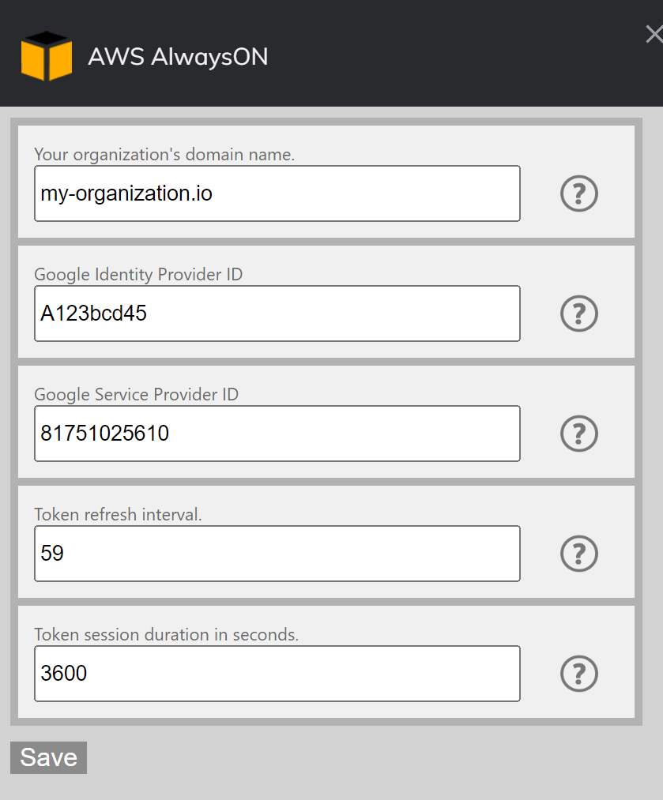

# AWS AlwaysON  
Chrome Extension that allows users that use Google Workspace (gsuite) as an IDP provier to AWS, to easily maintain sessions to the AWS console and get temporary STS credentials.
## Features
- Refresh AWS console session automatically to keep user logged in. 
- Get temporary credentials for assumed role to use for CLI access.

## Installation
Clone this repository.  
Go to Chrome Extensions page.  
Enable Developer Mode.  
Press Load Unpacked.  
Select the project folder.  

## Using the addon  
First you will need to configure some settings in the Options menu:  
  
Save and add your role/s.  
  

Click on the slider to start the token auto refresh procedure.  
After enabling the refresh you can also click on the CLI button to get the temporary STS credentials.  

## Changelog
[Changelog](/changelog.md)  

## To Do:  
Modify menu.html to support N number of accounts based on settings (build divs dynamically).  
make the cli button unclickbable and grayed out if the checkbox isn't checked.  
add option for OS so that the cli can create windows, linux and macos export commands(find OS from chrome).  