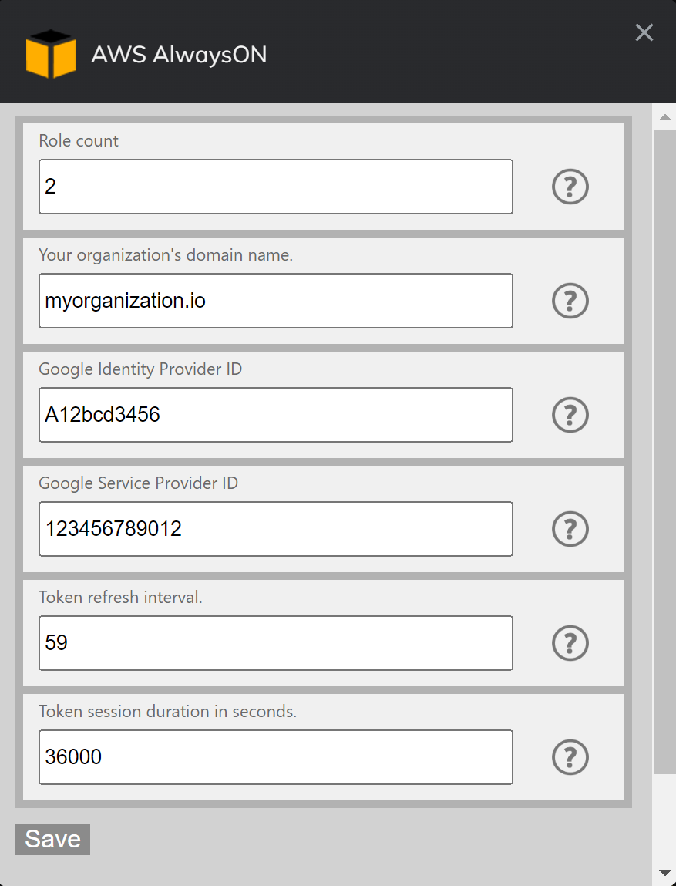

# AWS AlwaysON  

## Introduction
AWS AlwaysOn is a browser extension that allows users that use Google Workspace (gsuite) as an IDP provier to AWS, to easily maintain sessions to the AWS console and get temporary STS credentials.  
This extension can be used as an alternative to `aws-google-auth` and doesn't require inputing credentials as long as your Google account is logged in, nor does it suffer from constant Captcha.  
The extension was developed for Chrome but works mostly fine on all major browsers except Safari which was untested.  
## Features
- Refresh AWS Web Console session automatically to keep user logged in. 
- Get temporary credentials for assumed role to use for CLI access.

## Installation

### Option 1 (Chrome, Firefox, Edge, Opera, Brave*)
Available directly on Chrome Web Store and Add-ons for Firefox:  

\* Should technically work with any chromium based browser.
### Option 2
 **Google Chrome:**  
Clone this repository.  
Go to the Chrome Extensions page.  
Enable Developer Mode on the right side of the page.  
Press "Load Unpacked".  
Pick the project folder.  

**Mozilla Firefox:**  
Delete the regular manifest.js and rename the manifest-firefox.js to manifest.js  
Go to Addons and themes in the hamburger menu.  
Click the wheel and then Debug Add-ons.  
Click Load Temporary Add-on... and select the manifest.json file.  
## Using the extension  
First you will need to configure some properties in the Options menu. Each property has additional info that you can read to help you set it up properly.  
  
When you are done, press the Save button and exit the Options menu.  
Now you can add your user's IAM role or roles.    
  

Click on the slider to start the token auto refresh procedure.  
After enabling the refresh you can also click on the CLI button to get the temporary STS credentials.  
## Changelog:
Full changelog is available [here](/changelog.md).  
## Compatibility:
Tested and working on:  
Chrome - v101  
Brave - v1.38.111   
Edge  - v101      
Opera - v86  
Firefox - v100  
## Known issues:  
- (Edge) Options UI is smaller than the elements.  
- (Opera) Options UI opens in a full tab.  
## To Do:  
- (medium) Make the IAM role session timeout fallback to 3600 if configured more than maximum allowed.  
- (low) Add 2nd tier role assumption (using https://signin.aws.amazon.com/switchrole)  
- (very_low) Build options menu dynamically like I did with the roles menu.  
- Central Settings Management (random thought):  
    * add "settings are managed by an administrator" checkbox. if true; hide all the regular options. add new option called "management server url". on save, add additional permission to fetch from management_server_url. fetch settings from server(streaming connection?) and update local settings. add option to disable the toggle for management server url(make the toggle one-way).    
    * create a microservice that gets a request and responds with parameters(extention will pass email).   Microservice will be in the customer's datacenter for now.  
    https://developers.google.com/admin-sdk/directory/v1/guides/manage-users  
    create roll mapping (group(in gsuite)-role(manual/get from gsuite with api key?)).  
- Preset commands